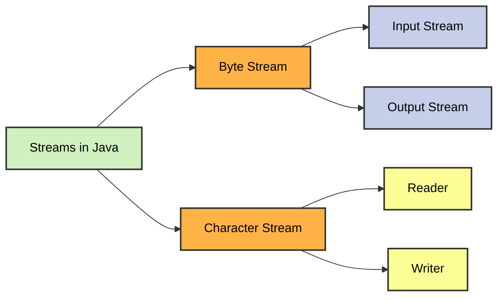

# File Handling 

File handling in Java allows you to **create**, **read**, **write**, **append**, and **delete** files using classes from the `java.io` package. It’s a core part of many Java applications where persistent data is needed.

---
### 🔧Structure of Streams in Java

---

### 🧰 Core Classes

| Class               | Description                                                                 |
|--------------------|-----------------------------------------------------------------------------|
| `File`             | Represents file or directory pathnames. Can be used to create/delete files. |
| `FileWriter`       | Writes characters to a file (overwrites by default).                        |
| `BufferedWriter`   | Buffers characters for efficient writing and supports `.newLine()`.         |
| `PrintWriter`      | Provides `print()`, `println()`, and `printf()` for formatted text output.  |
| `OutputStreamWriter` | Converts characters to bytes and writes to an output stream.              |
| `FileReader`       | Reads characters from a file.                                                |
| `BufferedReader`   | Buffers characters for efficient reading and supports `.readLine()`.        |
| `InputStreamReader`| Converts byte streams (like `System.in`) to character streams.              |

### ⚡ Buffered vs Unbuffered I/O

Buffered I/O is faster and more efficient than unbuffered I/O. Buffered classes read or write larger chunks of data at once, reducing the number of physical disk operations. This is especially useful for large files or frequent reads/writes.

---

### 🔄 Stream Wrapping

Java I/O streams and readers/writers are often **wrapped** around each other to combine their features. For example, wrapping a `FileWriter` with a `BufferedWriter` and then a `PrintWriter` gives you:
- File access
- Efficient buffering
- Easy-to-use `print()` and `println()` methods

---

### 🧹 File Deletion and Metadata

The `File` class also supports:
- **Deleting files**
- **Checking file existence**
- **Retrieving file name, path, and other properties**

These operations are useful for file lifecycle management and dynamic file handling.

---

### ✅ Best Practices

- Always close streams after use, or use **try-with-resources** for automatic cleanup.
- Use **buffered** readers/writers for performance.
- Use **append mode** when you want to add to a file without overwriting its contents.
- Always **check if a file exists** before trying to read or delete it.

---

### 📚 Further Reading

- [Official Java I/O Documentation](https://docs.oracle.com/javase/8/docs/api/java/io/package-summary.html)
- [Java File Handling - W3Schools](https://www.w3schools.com/java/java_files.asp)
